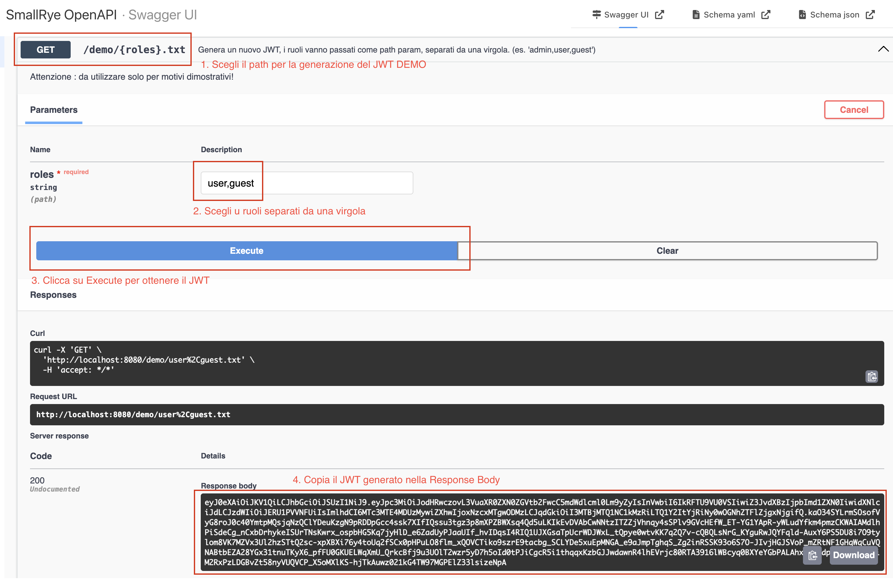
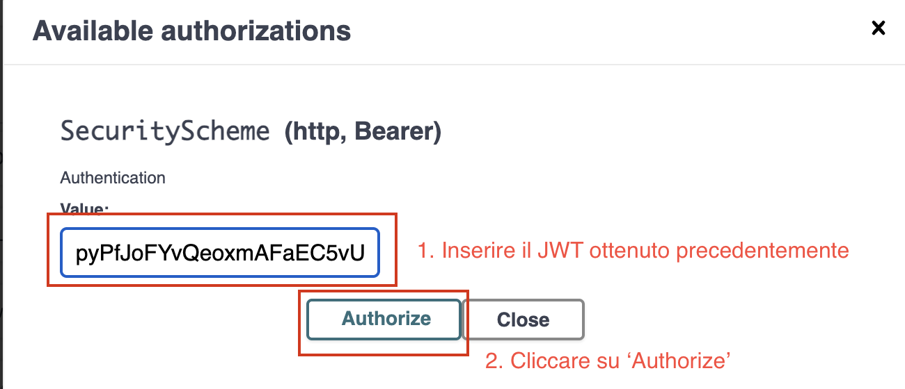
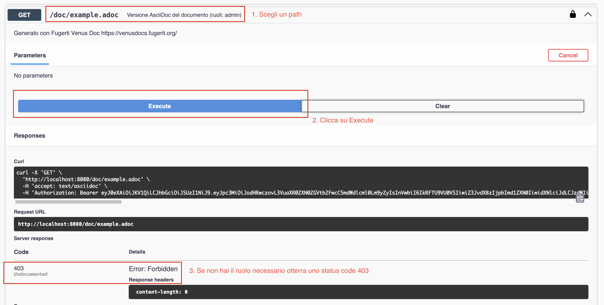
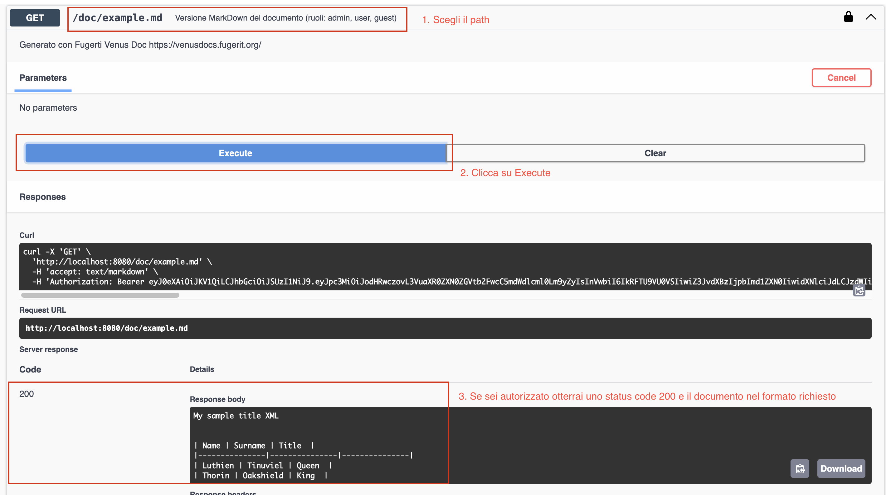
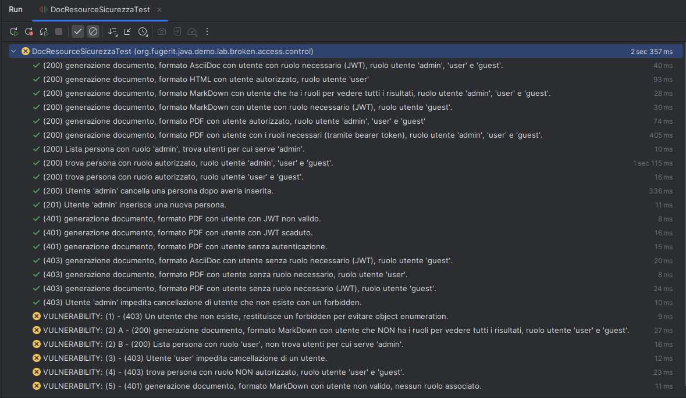
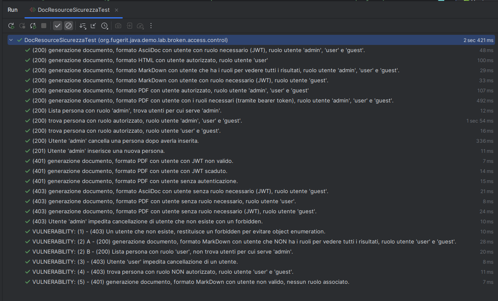

# Broken Access Control Lab

Un laboratorio educativo completo per testare e comprendere le vulnerabilità [Broken Access Control](https://owasp.org/Top10/2025/A01_2025-Broken_Access_Control/) nelle applicazioni Java.

> ⚠️ **ATTENZIONE**: Questo progetto contiene **intenzionalmente vulnerabilità di sicurezza** a scopo educativo. **NON utilizzare in produzione** e **NON esporre pubblicamente** senza aver rimosso tutte le vulnerabilità dimostrative.

> 🟢 Versione sanata (git checkout branch-vulnerable per accedere alla versione vulnerabile del progetto)

Le vulnerabilità di tipo [Broken Access Control](https://owasp.org/Top10/2025/A01_2025-Broken_Access_Control/) sono attualmente le più diffuse secondo il progetto [OWASP](https://owasp.org/). Sono al primo posto sia nella [OWASP Top 10](https://owasp.org/Top10/) del [2021](https://owasp.org/Top10/2021/) che [2025](https://owasp.org/Top10/2025/).

[](CHANGELOG.md)
[](https://opensource.org/licenses/MIT)

## Indice

### Il laboratorio

- [Quickstart](#quickstart)
- [Obiettivi del laboratorio](#obiettivi-del-laboratorio)
- [Cosa imparerai](#cosa-imparerai)
- [Il progetto](#il-progetto)
- [Lo scenario](#lo-scenario)
- [Vulnerabilità dimostrative](#vulnerabilità-dimostrative)
- [Architettura della sicurezza](#architettura-della-sicurezza)
- [Workflow del laboratorio](#workflow-del-laboratorio)
- [Riferimenti rapidi](#-riferimenti-rapidi)
- [FAQ / Problemi comuni](#-faq--problemi-comuni)
- [Licenza](#licenza)

### Contenuti extra

- [Note sugli unit test](JUNIT-TEST.md)
- [Security JUnit con tagging](JUNIT-TAG.md)
- [Troubleshooting](TROUBLESHOOTING.md)
- [Contribuire](CONTRIBUITING.md)

## Quickstart

### Requisiti

* Maven 3.9.x
* Java 21+

### Verifica dell'applicazione

Per eseguire i test standard:
```shell
mvn verify
```

Per attivare anche la verifica dei tag di sicurezza con il plugin `junit5-tag-check-maven-plugin`:
```shell
mvn verify -P security
```

### Avvio dell'applicazione
```shell
mvn quarkus:dev
```

### Utilizzo dell'applicazione

1. Apri la [Swagger UI](http://localhost:8080/q/swagger-ui/)
2. Genera un JWT token (vedi sezione successiva)
3. Autorizza le richieste con il token
4. Testa gli endpoint disponibili

### Generazione e utilizzo dei JWT token

#### Generazione del token

Usa l'endpoint `/demo/{roles}.txt` per generare un JWT con i ruoli desiderati.

> ⏱️ **Durata token**: 1 ora (3600 secondi)  
> 🔑 **Algoritmo**: RS256 (RSA Signature con SHA-256)  
> 📝 **Issuer**: `https://unittestdemoapp.fugerit.org`

**Ruoli disponibili:**

| Ruolo   | Permessi                           | Esempio di utilizzo        |
|---------|------------------------------------|----------------------------|
| `admin` | Accesso completo a tutti i formati | Operazioni di gestione     |
| `user`  | Accesso a MarkDown e HTML          | Lettura documenti standard |
| `guest` | Accesso solo a MarkDown            | Visualizzazione base       |

**Esempi di generazione da console:**
```bash
# Token con singolo ruolo
curl http://localhost:8080/demo/guest.txt
```
```bash
# Token con ruoli multipli (separati da virgola)
curl http://localhost:8080/demo/admin,user.txt
```

> ⚠️ **Nota importante**: L'endpoint `/demo/{roles}.txt` è fornito **solo per scopi dimostrativi**.
> In produzione, l'autenticazione deve avvenire tramite un Identity Provider (IDP) esterno.

**Esempi di generazione da Quarkus Swagger UI:**



Qui c'è un payload del JWT completo generato come esempio:
```json
{
  "iss": "https://unittestdemoapp.fugerit.org",
  "upn": "DEMOUSER",
  "groups": [
    "guest",
    "user"
  ],
  "sub": "DEMOUSER",
  "iat": 1771234632,
  "exp": 1771238232,
  "jti": "ab2addbf-f776-4a7a-8b3d-4c0701f316d1"
}
```

Puoi usare strumenti online come [jwt.io](https://www.jwt.io/) per verificare il contenuto del tuo JWT.

#### Autorizzazione nella Swagger UI

1. Clicca sul pulsante **"Authorize"** nella Swagger UI
2. Inserisci il JWT ottenuto in precedenza nel formato: `Bearer <token>`
3. Clicca su "Authorize"



### Test: Accesso negato (403 Forbidden)

Se tenti di accedere a un endpoint senza i ruoli necessari, riceverai un errore 403.

**Esempio**: Tentativo di accesso a `/doc/example.adoc` senza ruolo `admin`



### Test: Accesso consentito (200 OK)

Con i ruoli appropriati, puoi accedere agli endpoint autorizzati.

**Esempio**: Accesso a `/doc/example.md` con ruoli `guest` o `user`



Vedi la [mappatura di ruoli e path](#mappatura-ruoli--permessi--metodo-http) per maggiori dettagli.

## Workflow del laboratorio

### Passo 1: Setup iniziale
```bash
git clone https://github.com/fugerit79/lab-broken-access-control-quarkus.git
cd lab-broken-access-control-quarkus
mvn quarkus:dev
```

### Passo 2: Esplora le vulnerabilità

- Apri `DocResource.java`
- Cerca i commenti `// VULNERABILITY: (n)`
- Analizza il codice vulnerabile
- Identifica il tipo di vulnerabilità (IDOR, BOLA, etc.)

### Passo 3: Esegui i test
```bash
mvn verify -P security
```

I test falliranno dove ci sono vulnerabilità. Osserva gli errori per capire cosa non funziona.

### Passo 4: Correggi le vulnerabilità

- Implementa le correzioni seguendo le best practices OWASP
- Verifica con i test che le modifiche funzionino
- Confronta con le soluzioni (`// SOLUTION: (n)`)

### Passo 5: Verifica la copertura
```bash
mvn verify -P security
```

Tutti i test devono passare ✅

### Passo 6: Trova la vulnerabilità BONUS

Cerca la vulnerabilità (X) che non è coperta dai test. Suggerimenti:
- Esamina tutti gli endpoint
- Cerca metodi HTTP non documentati
- Controlla le annotation mancanti

## Obiettivi del laboratorio

Questo laboratorio ti permetterà di:

- 🎯 Comprendere le vulnerabilità Broken Access Control in pratica
- 🔍 Identificare pattern di codice vulnerabile
- 🛡️ Imparare tecniche di mitigazione e best practices
- ✅ Implementare test di sicurezza efficaci con JUnit tags
- 📊 Misurare la copertura dei requisiti di sicurezza

## Cosa imparerai

Completando questo laboratorio, acquisirai competenze pratiche su:

- 🔐 **Autenticazione JWT**: Implementazione e configurazione in Quarkus
- 🛡️ **RBAC**: Design e implementazione di Role-Based Access Control
- 🐛 **Vulnerability Detection**: Identificazione di BOLA, IDOR e privilege escalation
- ✅ **Security Testing**: Strategia di test con JUnit tags e coverage
- 📊 **Security Metrics**: Misurazione della copertura dei requisiti di sicurezza
- 🔒 **Defense in Depth**: Approccio a più livelli per la sicurezza applicativa

## Il progetto

Questo progetto dimostra come implementare una strategia di testing basata su tag JUnit per garantire la copertura dei requisiti di sicurezza in un'applicazione Quarkus con autenticazione JWT e RBAC (Role-Based Access Control).

### Stack tecnologico

I principali componenti usati per questo progetto sono:

- [Quarkus - Stack cloud-native ottimizzato per OpenJDK HotSpot e GraalVM](https://quarkus.io/)
- [junit5-tag-check-maven-plugin - Plugin Maven che permette di verificare che dei test con tag specifici siano stati eseguiti](https://github.com/fugerit-org/junit5-tag-check-maven-plugin)
- [Fugerit Venus Doc - Framework per la generazione di documenti in vari formati (usato solo per le funzionalità dimostrative)](https://github.com/fugerit-org/fj-doc)

## Lo scenario

Nel nostro scenario, abbiamo una base dati popolata e alcuni path disponibili.

### Base dati

Esiste una base dati di persone (sono entità di dominio, non utenti). La tabella PEOPLE è pre-popolata con 3 soggetti, che hanno 4 proprietà principali:

- Nome, Cognome, Titolo descrivono la persona
- Ruolo minimo: rappresenta il ruolo minimo richiesto per poter accedere a quella persona

| Nome       | Cognome | Titolo      | Ruolo minimo |
|------------|---------|-------------|--------------|
| Richard    | Feynman | Fisico      | admin        |
| Margherita | Hack    | Astrofisica | -            |
| Alan       | Turing  | Matematico  | -            |

> **NOTA**: Nel nostro DB pre-popolato tutti possono vedere i dati di Margherita Hack e Alan Turing, ma per vedere i dati di Richard Feynman (che sta lavorando al progetto Manhattan), serve il ruolo 'admin'.

### Mappatura ruoli / permessi / metodo http

L'applicazione è configurata per gestire 3 ruoli e 4 path, che generano lo stesso documento in formati diversi. Non tutti i ruoli sono autorizzati a generare ogni path. Ecco la mappa dei permessi:

| Path                        | Output      | Ruoli autorizzati  | Metodo http |
|-----------------------------|-------------|--------------------|-------------|
| `/doc/example.md` (*)       | 📝 MarkDown | admin, user, guest | GET         |
| `/doc/example.adoc`         | 📄 AsciiDoc | admin              | GET         |
| `/doc/example.html` (*)     | 🌐 HTML     | admin, user        | GET         |
| `/doc/example.pdf`          | 📑 PDF      | admin              | GET         |
| `/doc/person/list` (*)      | 📋 JSON     | admin, user        | GET         |
| `/doc/person/find/{id}` (*) | 📋 JSON     | admin, user        | GET         |
| `/doc/person/add`           | 📋 JSON     | admin              | POST        |
| `/doc/person/delete/{id}`   | 📋 JSON     | admin              | DELETE      |

> (*) Eccetto gli utenti con ruolo 'admin', su questi path potrebbe esserci una limitazione ai dati mostrati in base al ruolo minimo richiesto.

**Ruoli e permessi dettagliati:**

| Ruolo   | Permessi                           | Esempio di utilizzo                         |
|---------|------------------------------------|---------------------------------------------|
| `admin` | Accesso completo a tutti i formati | Vedere Richard Feynman, gestire persone     |
| `user`  | Accesso a MarkDown e HTML          | Vedere Hack e Turing, documenti base        |
| `guest` | Accesso solo a MarkDown            | Visualizzazione read-only limitata          |

## Vulnerabilità dimostrative

Questo laboratorio include 6 vulnerabilità reali di tipo Broken Access Control:

| #   | Vulnerabilità                 | Classificazione | Endpoint                                                   | Status   |
|-----|-------------------------------|-----------------|------------------------------------------------------------|----------|
| (1) | ID Enumeration                | IDOR            | `/person/find/{id}`                                        | 🟢 Fixed |
| (2) | Privilege Escalation (Data)   | BOLA            | `/doc/example.md`, `/doc/example.html`, `/doc/person/list` | 🟢 Fixed |
| (3) | Privilege Escalation (Action) | BOLA            | `/doc/person/delete/{id}`                                  | 🟢 Fixed |
| (4) | Broken Object Authorization   | BOLA            | `/doc/person/find/{id}`                                    | 🟢 Fixed |
| (5) | Missing Authentication        | Access Control  | `/doc/example.md`                                          | 🟢 Fixed |
| (X) | Hidden Vulnerability (BONUS)  | Access Control  | `/person/add` (PUT)                                        | 🟢 Fixed |

> 💡 **Sfida**: La vulnerabilità (X) non è coperta dai test. Riesci a trovarla?

### Descrizione delle vulnerabilità

#### (1) ID Enumeration (IDOR)

È possibile individuare gli identificativi delle persone esistenti distinguendo tra risposte 404 (non esiste) e 403 (non autorizzato).

**Endpoint**: `/person/find/{id}`

**Problema**: Risposta diversa per ID esistenti vs non esistenti
```
GET /person/999  → 404 Not Found (non esiste)
GET /person/10002 → 403 Forbidden (esiste ma non autorizzato)
```

**Soluzione**: Risposta uniforme (sempre 403) per evitare enumerazione

#### (2) Privilege Escalation - Visualizzazione dati

L'utente riesce a vedere dati che dovrebbero essere disponibili solo per il profilo 'admin'.

**Endpoint**: `/doc/example.md`, `/doc/example.html`, `/doc/person/list`

**Problema**: Utenti con ruolo 'user' vedono Richard Feynman (minRole=admin)

**Soluzione**: Filtrare i dati in base ai ruoli dell'utente autenticato

#### (3) Privilege Escalation - Cancellazione

L'utente riesce a cancellare una persona anche se non ha il ruolo 'admin'.

**Endpoint**: `/doc/person/delete/{id}`

**Problema**: `@RolesAllowed` include erroneamente "user"

**Soluzione**: Rimuovere "user" da `@RolesAllowed`, lasciando solo "admin"

#### (4) Broken Object Level Authorization

L'utente riesce a vedere dati che non dovrebbero essere disponibili per il suo profilo.

**Endpoint**: `/doc/person/find/{id}`

**Problema**: Verifica del ruolo minimo mancante

**Soluzione**: Controllare `person.getMinRole()` vs `securityIdentity.getRoles()`

#### (5) Missing Authentication

L'utente riesce ad accedere al documento anche se non è autenticato.

**Endpoint**: `/doc/example.md`

**Problema**: `@RolesAllowed` annotation mancante

**Soluzione**: Aggiungere `@RolesAllowed({ "admin", "user", "guest" })`

#### (x) Hidden Vulnerability (BONUS)

una put senza controllo di autorizzazione è rimasta abilitata per errore.

**Endpoint**: `/person/add` (PUT)

**Problema**: Il metodo è utilizzabile senza autenticazione

**Soluzione**: rimuoviamo totalmente il metodo addPersonPut()

```java
    @APIResponse(responseCode = "201", description = "La persona è stata creata", content = @Content(mediaType = MediaType.APPLICATION_JSON, schema = @Schema(implementation = AddPersonResponseDTO.class)))
    @APIResponse(responseCode = "401", description = "Se l'autenticazione non è presente")
    @APIResponse(responseCode = "403", description = "Se l'utente non è autorizzato per la risorsa")
    @APIResponse(responseCode = "500", description = "In caso di errori non gestiti")
    @Tag(name = "person")
    @Operation(operationId = "addPersonPut", summary = "Aggiunge una persona al database (ruoli: admin)", description = "Vanno forniti i parametri, nome, cognome, titolo e ruolo minimo.")
    @PUT
    @Path("/person/add")
    @Transactional
    public Response addPersonPut(AddPersonRequestDTO request) {
        return this.addPerson(request);
    }
```

---

Le vulnerabilità da risolvere saranno presenti a partire dal servizio REST:

- [DocResource](src/main/java/org/fugerit/java/demo/lab/broken/access/control/DocResource.java)

Visto che questo progetto segue l'approccio del *Test-driven development* abbiamo scritto prima i test della nostra applicazione, ovvero:

- [DocResourceSicurezzaTest](src/test/java/org/fugerit/java/demo/lab/broken/access/control/DocResourceSicurezzaTest.java) - Test di sicurezza, in particolare gli accessi non autorizzati

I casi di test dove sono presenti vulnerabilità falliranno, per quelli sarà presente il commento:
```java
// VULNERABILITY: (n) risolvi questa vulnerabilità in modo che il caso di test funzioni.
```

Una volta pubblicate le soluzioni, le potrai trovare cercando il commento:
```java
// SOLUTION: (n) 
```

Dove (n) è l'id del comportamento vulnerabile introdotto, ad esempio (1).

In totale saranno presenti 5 vulnerabilità. Ognuna farà fallire uno dei casi di test. Solo la numero (2) farà fallire 2 casi di test.

> **BONUS**: C'è un path che contiene una vulnerabilità non censita negli unit test, nella soluzione sarà censita come SOLUTION: (X)

Da notare che prima della risoluzione, l'esecuzione della suite di test *DocResourceSicurezzaTest* porterà a questo risultato (6 casi di test falliti)



Mentre dopo aver applicato le patch il risultato dovrebbe essere un questo



Buon lavoro!

## Architettura della sicurezza

L'applicazione implementa un sistema di sicurezza a più livelli:

1. **Autenticazione JWT**: Verifica dell'identità tramite token firmati
2. **RBAC**: Controllo accessi basato su ruoli
3. **Object-Level Authorization**: Verifica permessi su singoli oggetti
4. **Test automatizzati**: Garanzia della copertura dei requisiti di sicurezza tramite tag JUnit

### Flusso di autenticazione
```
User → JWT Token → Quarkus Security → Role Check → Object Authorization → Resource Access
```

## 📚 Riferimenti rapidi

| Risorsa              | Link                                  |
|----------------------|---------------------------------------|
| Swagger UI           | http://localhost:8080/q/swagger-ui/   |
| Dev UI               | http://localhost:8080/q/dev/          |
| Health Check         | http://localhost:8080/q/health        |
| OWASP Top 10 (2025)  | https://owasp.org/Top10/2025/         |
| OWASP API Security   | https://owasp.org/API-Security/       |
| JWT Debugger         | https://jwt.io/                       |
| Quarkus Security     | https://quarkus.io/guides/security    |

## ❓ FAQ / Problemi comuni

<details>
<summary><b>Il token JWT scade troppo velocemente</b></summary>

I token hanno validità di 1 ora. Genera un nuovo token con:
```bash
curl http://localhost:8080/demo/admin,user.txt
```

Oppure usa la Swagger UI per rigenerarlo rapidamente.
</details>

<details>
<summary><b>Errore 403 anche con il token corretto</b></summary>

Verifica:
1. ✅ Token non scaduto (controlla `exp` su jwt.io)
2. ✅ Ruolo appropriato per l'endpoint (vedi tabella permessi)
3. ✅ Header Authorization corretto: `Bearer <token>` (con lo spazio)
4. ✅ Token copiato completamente senza spazi extra
</details>

<details>
<summary><b>I test di sicurezza non vengono eseguiti</b></summary>

Usa il profilo security:
```bash
mvn verify -P security
```

Il profilo `security` attiva il plugin `junit5-tag-check-maven-plugin` che verifica la copertura dei test taggati.
</details>

<details>
<summary><b>Quarkus non si avvia - porta 8080 occupata</b></summary>

Cambia la porta in `application.properties`:
```properties
quarkus.http.port=8081
```

Oppure termina il processo che occupa la porta 8080:
```bash
# Linux/Mac
lsof -ti:8080 | xargs kill -9

# Windows
netstat -ano | findstr :8080
taskkill /PID <PID> /F
```
</details>

<details>
<summary><b>Errore 401 Unauthorized su tutti gli endpoint</b></summary>

Hai dimenticato di autorizzare nella Swagger UI. Clicca sul pulsante "Authorize" in alto a destra e inserisci il token nel formato:
```
Bearer eyJ0eXAiOiJKV1QiLCJhbGc...
```
</details>

<details>
<summary><b>Come faccio a vedere Richard Feynman?</b></summary>

Richard Feynman ha `minRole=admin`, quindi serve un token con ruolo `admin`:
```bash
curl http://localhost:8080/demo/admin.txt
```

Poi usa questo token per chiamare `/doc/person/list` o `/doc/example.md`.
</details>

<details>
<summary><b>I test passano ma la vulnerabilità è ancora presente</b></summary>

Ricorda che ci sono 6 vulnerabilità:
- 5 coperte dai test (che devono passare)
- 1 BONUS non coperta dai test (devi trovarla manualmente)

Cerca `// SOLUTION: (X)` nel codice per vedere la vulnerabilità nascosta.
</details>

## Licenza

Questo progetto è rilasciato sotto licenza MIT - vedi il file [LICENSE](LICENSE) per i dettagli.

---

## 🎓 Per ulteriori informazioni

- 📖 [Note sugli unit test](JUNIT-TEST.md)
- 🏷️ [Security JUnit con tagging](JUNIT-TAG.md)
- 🔧 [Troubleshooting avanzato](TROUBLESHOOTING.md)
- 🤝 [Come contribuire](CONTRIBUITING.md)

---

**Sviluppato con ❤️ per la community della sicurezza applicativa**